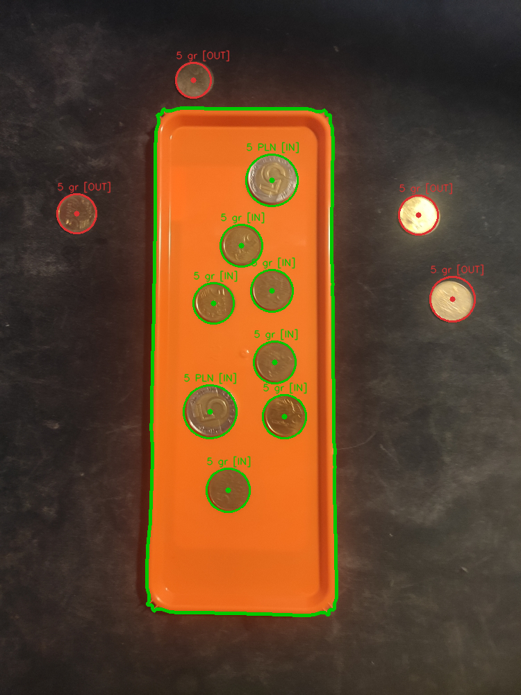
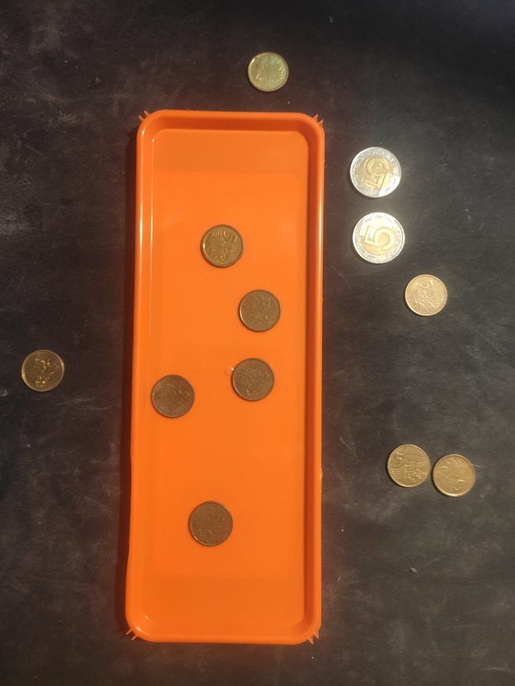
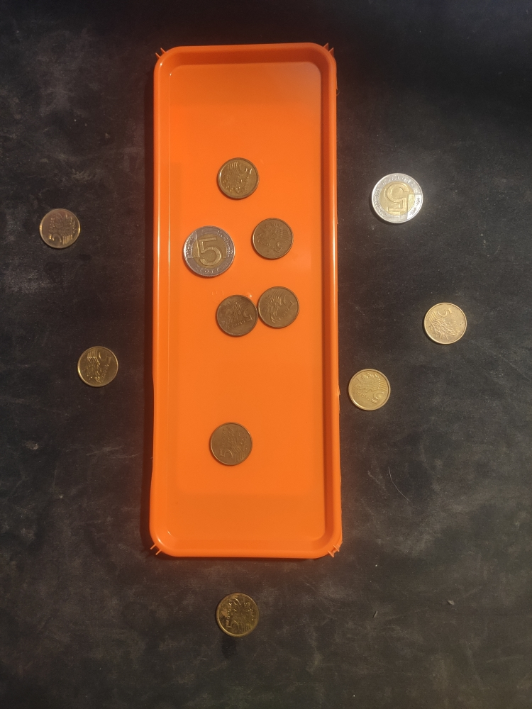
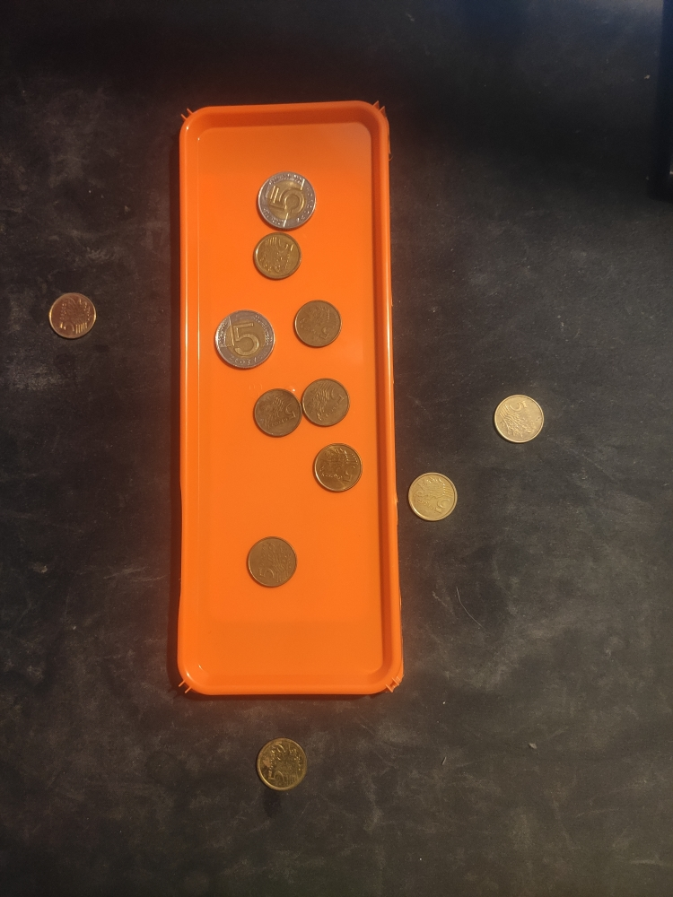
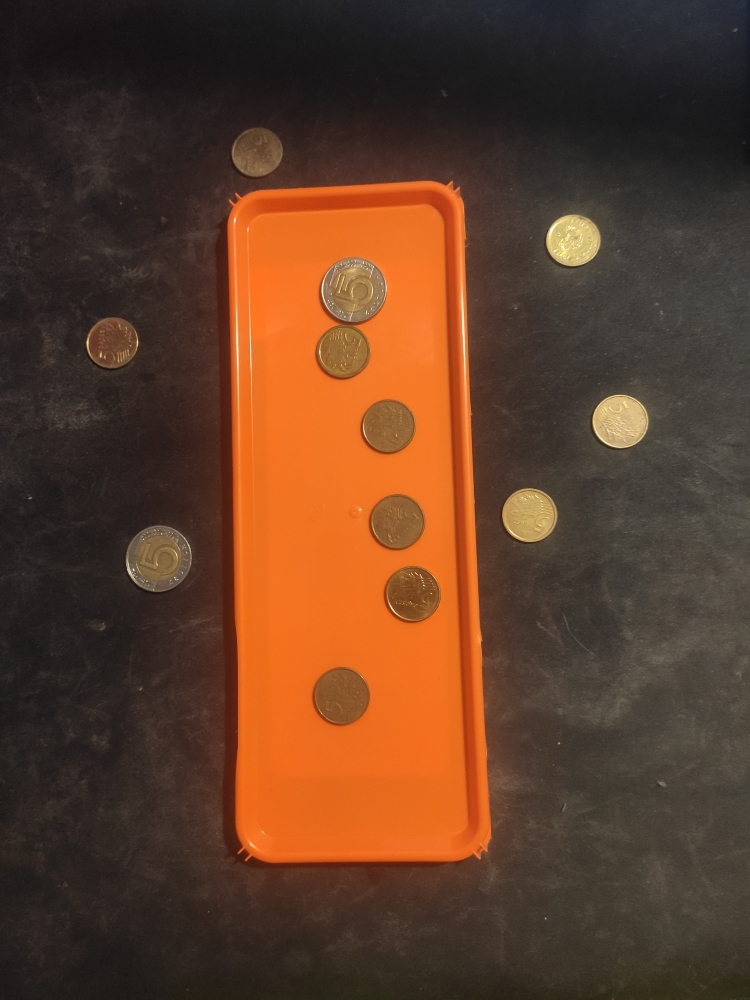
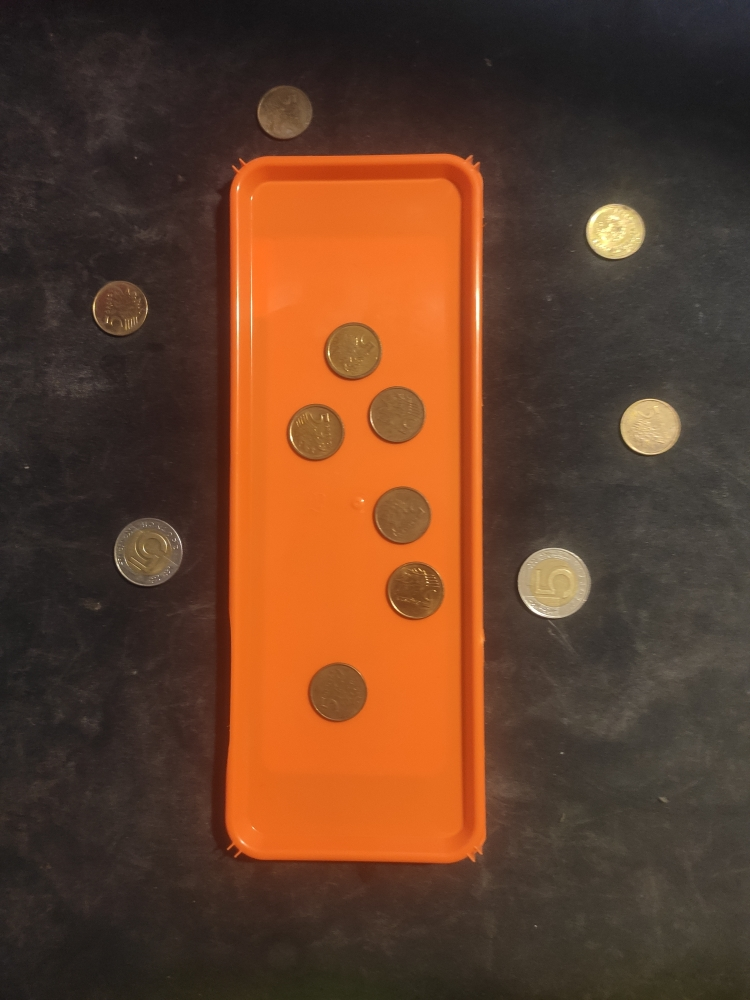
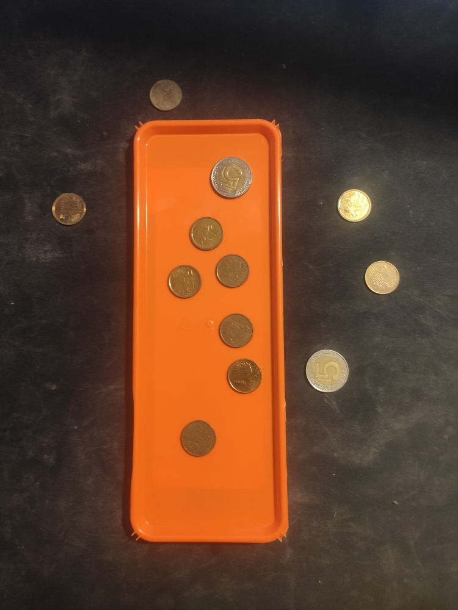
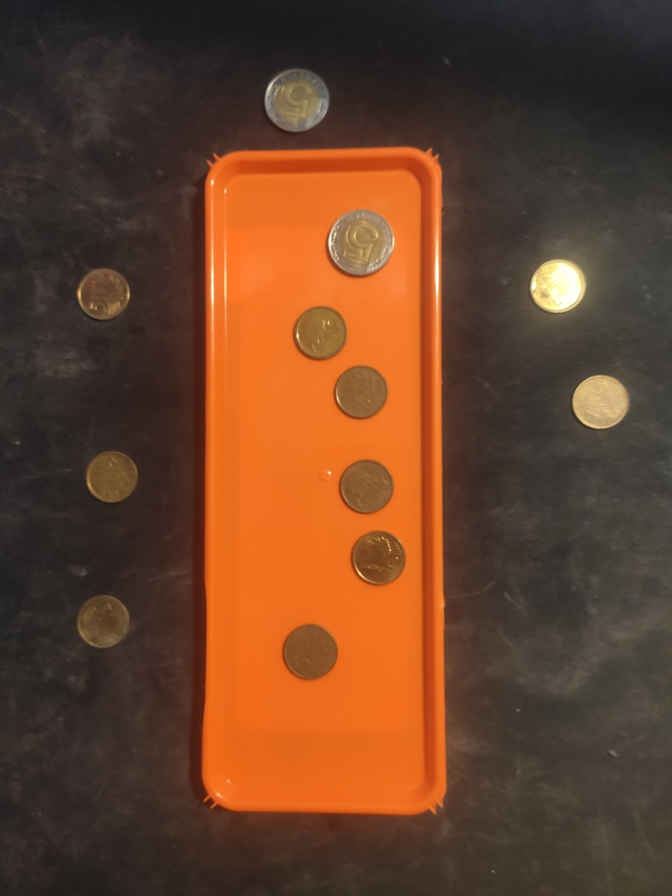

# Coin Tray Analyzer — Edge Detection

Automatically counts and values Polish coins on a tray from a static photo. Uses **Canny edge detection** to find the tray boundary and **Hough Circle Transform** to detect individual coins, then reports total value in PLN — separately for coins on and off the tray.

## Example Output

| Input | Detected (green = on tray, red = off tray) |
|-------|---------------------------------------------|
|  |  |

```
------------------------------
PODSUMOWANIE MONET:
Na tacce   -> Duże: 2, Małe: 6
Poza tacką -> Duże: 0, Małe: 4
------------------------------
PODSUMOWANIE KWOT:
Kwota na tacce   : 10.3 PLN
Kwota poza tacką : 0.2 PLN
------------------------------
```

## Sample Dataset

8 test images with varying coin counts and arrangements:

<table>
  <tr>
    <td></td>
    <td></td>
    <td></td>
    <td></td>
  </tr>
  <tr>
    <td></td>
    <td></td>
    <td></td>
    <td></td>
  </tr>
</table>

## How It Works

### Step 1 — Tray Detection
```
Grayscale → GaussianBlur(7×7) → Canny(50,150)
→ MorphClose(5×5, 2 iter) → findContours → largest contour = tray
```

### Step 2 — Coin Detection
```
HoughCircles(dp=1.2, minDist=40, param1=50, param2=50, r=20–80px)
```

### Step 3 — Classification
| Coin type | Radius threshold | Value |
|-----------|-----------------|-------|
| Large (e.g. 5 PLN) | > 34 px | 5.0 PLN |
| Small (e.g. 5 gr) | ≤ 34 px | 0.05 PLN |

Each detected circle center is tested against the tray contour using `pointPolygonTest` to determine if the coin is inside or outside.

## Project Structure

```
EdgeRecognition/
├── main.py          # full analysis pipeline
├── main.ipynb       # interactive Jupyter version
├── requirements.txt
└── assets/
    ├── tray1.jpg
    ├── ...
    └── tray8.jpg
```

## Requirements

```bash
pip install -r requirements.txt
```

## Usage

```bash
python main.py
```

Processes all `assets/tray*.jpg` images and prints coin counts + PLN values to the console.

## Tech Stack

`Python` · `OpenCV` · `NumPy` · `Matplotlib`
